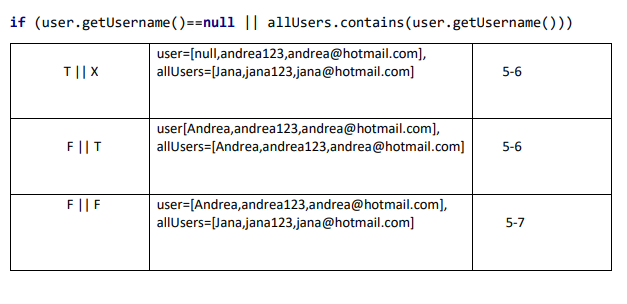
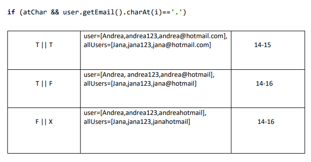
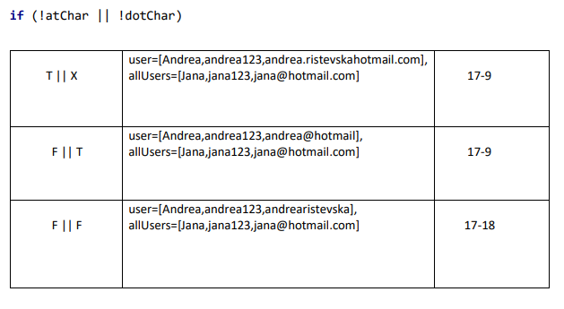

# Втора лабораториска вежба по Софтверско инженерство
## Андреа Ристевска, бр. на индекс 186018
### Група на код:
Ја добив групата на код 2
### Control Flow Graph
Графот на сликата подолу го направив во Draw.io. Јазлите се означени според броевите од линиите кои припаѓаат на функцијата finction во кодот кој ми беше даден. Кодот со броевите го поставив на SILab2_kod_broevi.txt.

### Цикломатска комплексност
Цикломатската комплексност е 8 и  ја добив со формулата:
E-N+2 каде што Е е бројот на ребра во графот погоре, а N е бројот на јазли во истиот тој граф. А истата комплекснот ќе ја добиеме и ако ги изброиме регионите од графот на цртежот.
27-21+2=8

### Тест случаи според критериумот Every branch
Every branch ги вклучува сите разгранувања од секој јазол го графот, односно сите ребра кои ги има во графот. Дефинирав  тест случаи во кои се опфатени сите ребра од графот.Тие се следните: 
1). user=null, allUsers=anything 
2). user=[null,andrea123, andrea@hotmail.com], allUsers.contains(user.getUsername()) 
3). user=[Andrea,andrea123,null], allUsers=user 
4). user=[Andrea,andrea123, andrea.ristevska@hotmail.com], allUsers=user 
5). user=[Andrea,andrea123, andrearistevska], allUsers=user 
На сликата е претсавена табелата:

### Тест случаи според критериумот Multiple conditions
Multiple conditions се прави во кодот таму каде што имаме во услов две или повеќе можности. Тест случаите и комбинациите за условите кои ги искористив ги има во следните табели:
  
### Објаснување на напишаните unit tests
Ги поставив тест случаитњ во кодот за Every branch и multiple conditions, кој се наоѓа во src/test/java и за сите тест случаи кодот ми работеше, така што успешно го спроведов тестирањето.
